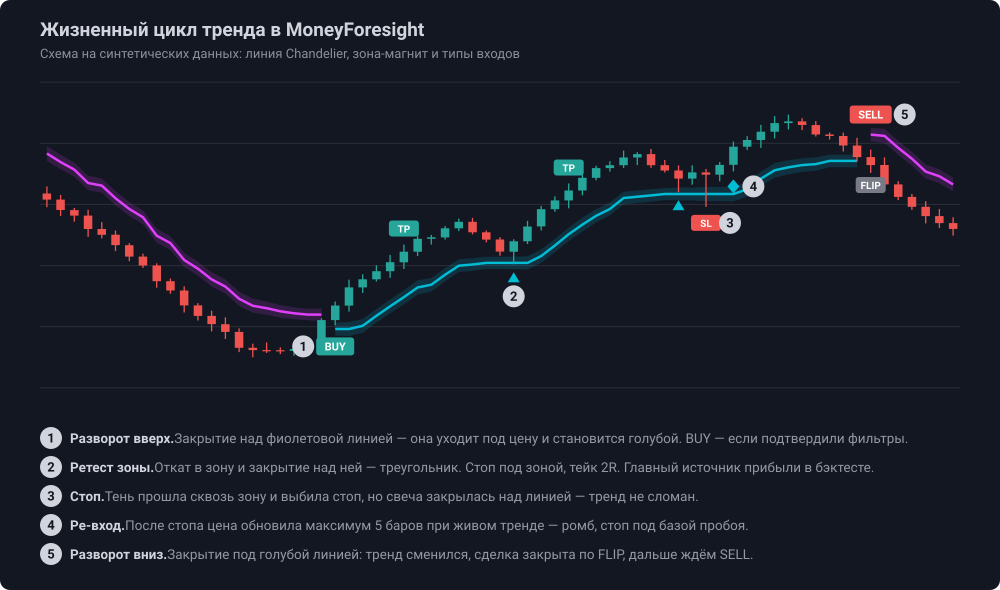

# Как работать с индикатором MoneyForesight

Практическое руководство: как индикатор определяет тренд, что означает каждый элемент на
графике, где входить и где лучше не входить, как читать таблицы. Всё описанное соответствует
коду [`MoneyForesight_v3.pine`](../MoneyForesight_v3.pine) (v3.2). Про установку и полный список
настроек — в [README](../README.md).

> **Это не финансовая рекомендация.** Правила ниже — описание того, как устроен индикатор, и
> выводы из бэктеста на истории. Там, где правило не проверено на данных, это сказано прямо.
> Любую схему сначала проверьте в «Тестере стратегий» и на демо-счёте.

## Содержание

- [Шпаргалка](#шпаргалка)
- [1. Линия Chandelier: как образуется тренд](#1-линия-chandelier-как-образуется-тренд)
- [2. Зона-магнит](#2-зона-магнит)
- [3. Три типа входа](#3-три-типа-входа)
- [4. Где покупать, а где нет](#4-где-покупать-а-где-нет)
- [5. Поддержка и сопротивление](#5-поддержка-и-сопротивление)
- [6. Таблица статистики: отбой и пробой](#6-таблица-статистики-отбой-и-пробой)
- [7. Порядок работы: чек-лист](#7-порядок-работы-чек-лист)
- [8. Частые ошибки](#8-частые-ошибки)

## Шпаргалка

| Что видите на графике | Что это значит | Что делать |
|---|---|---|
| Линия **голубая**, цена над ней | Восходящий тренд | Искать только покупки |
| Линия **фиолетовая**, цена под ней | Нисходящий тренд | Искать только продажи |
| Свеча **закрылась** по другую сторону линии, линия сменила цвет | Тренд сменился | Закрыть сделку против нового тренда (FLIP). Входить пока рано — ждать подтверждения |
| Метка **BUY / SELL** | Смена тренда подтверждена всеми фильтрами | Ранний, но самый шумный вход. Осторожнее — дождаться первого ретеста |
| **Треугольник** у зоны | Откат в зону и отбой от неё по тренду | Основной вход по тренду. Стоп — за зоной |
| **Ромб** | Стоп выбило, но тренд жив и цена обновила экстремум | Повторный вход. Стоп — за базой пробоя |
| Свеча закрылась **внутри** зоны | Отбой ещё не случился | Ждать закрытия за зоной. Не входить заранее |
| Линия часто меняет цвет, цена «пилит» зону | Боковик | Не торговать |
| Красный канал S/R прямо над ценой | Сопротивление близко | С покупкой осторожно: тейк может упереться |

## 1. Линия Chandelier: как образуется тренд

Линия Chandelier — это **скользящий стоп по волатильности**. Она всегда стоит по одну сторону
от цены и по её цвету видно направление тренда.

**В восходящем тренде** (линия голубая, под ценой) линия равна максимуму последних 22 свечей
минус 3 ATR. Она тянется за ценой вверх и **никогда не опускается**: если цена откатывает, линия
стоит на месте.

**В нисходящем тренде** (линия фиолетовая, над ценой) линия равна минимуму последних 22 свечей
плюс 3 ATR. Она идёт за ценой вниз и никогда не поднимается.

### Как образуется восходящий тренд

1. Идёт падение, фиолетовая линия висит над ценой и опускается вслед за ней.
2. Цена разворачивается и растёт. Фиолетовая линия стоит на месте, потому что вверх она не ходит.
3. Когда свеча **закрывается выше фиолетовой линии**, тренд считается сменившимся. Это значит, что
   цена ушла от недавнего минимума больше чем на 3 ATR, а такой ход уже не шум.
4. Линия «перепрыгивает» под цену и становится голубой. Теперь она тянется вверх за ценой.

**Нисходящий тренд** образуется зеркально: свеча закрывается ниже голубой линии, линия
перепрыгивает над ценой и становится фиолетовой.

### Важные детали

- **Считается только закрытие свечи.** Тень, проколовшая линию, тренд не меняет.
- **Смена цвета линии — это ещё не сигнал на вход.** Пересечение линии вверх действительно
  означает переход к покупкам, а вниз — к продажам. Но BUY или SELL появляется, только
  когда смену тренда подтвердят ещё пять условий (см. [раздел 3](#buy--sell--смена-тренда)).
  Если линия развернулась, а метки нет, значит разворот ничем не подтверждён: например, мало объёма
  или рынок во флэте.
- **Цвет свечей и цвет линии — разные вещи.** Свечи красятся по состоянию сигнала, а оно меняется,
  только когда выполнены все условия противоположного сигнала. Поэтому бывает, что линия уже
  фиолетовая, а свечи ещё зелёные: тренд по линии сломан, но полного сигнала на продажу пока нет.
- **Rainbow MA** — плавная линия с градиентом от красного к зелёному. Зелёная половина палитры
  означает, что импульс на стороне покупателей, красная — на стороне продавцов. Индикатор
  использует её как фильтр: BUY только в зелёной половине, SELL — в красной.

## 2. Зона-магнит

Вокруг линии рисуется полупрозрачная полоса шириной ± 0.25 ATR — **зона-магнит**. Идея
автора: линия Chandelier работает как зона ликвидности.

- **В тренде** цена откатывает к зоне и **отбивается** от неё. В восходящем тренде зона —
  поддержка, в нисходящем — сопротивление.
- **Конец тренда** — это когда цена проходит зону насквозь и закрывается за линией. Тогда линия
  меняет цвет (см. выше).
- **В боковике** зона не держит: цена режет её в обе стороны, линия часто меняет цвет.

Работает ли магнит на вашем инструменте и таймфрейме, показывает таблица статистики
(см. [раздел 6](#6-таблица-статистики-отбой-и-пробой)).

## 3. Три типа входа

Все входы проверяются **по закрытию свечи**. Одновременно открыта только одна сделка: пока она
не закрыта, новые сигналы не открывают вторую.

### BUY / SELL — смена тренда

Метка **BUY** появляется на свече, где одновременно выполнено всё:

| Условие | Что проверяет |
|---|---|
| Линия Chandelier голубая | Тренд по волатильности вверх |
| DI+ выше DI− | Покупатели сильнее продавцов (индикатор DMI) |
| MACD выше сигнальной линии | Импульс направлен вверх |
| Rainbow в зелёной половине | Сила на стороне покупателей |
| Объём выше средней × 1.2 | Разворот поддержан деньгами |
| ADX ≥ порога (20) или растёт от половины порога | Есть тренд, а не флэт |

SELL — зеркально. Метка ставится один раз, в момент смены состояния, а не на каждой свече.

**Сорт A и B.** Яркая крупная метка — сорт **A**: стоп близко, не дальше 2 ATR. Мелкая бледная —
сорт **B**: стоп далеко. Это **не оценка качества сигнала**. В бэктесте сорт B отработал не хуже A
(см. таблицу ниже). Сорт говорит о другом: при далёком стопе позиция должна быть **меньше**, чтобы
риск в деньгах остался прежним.

**Стоп и тейк.** Стоп — за внешним краем зоны (для BUY — под нижним краем). Тейк — вход плюс
2 × риск (настройка `Take Profit (R multiple)`). На графике появляются красный бокс риска и
зелёный бокс прибыли с ценами SL и TP.

### Ретест зоны — основной вход по тренду

**Треугольник под свечой (для лонга)** появляется, когда:

1. линия голубая уже минимум 2 свечи подряд (в свече разворота ретеста не бывает);
2. цена откатила в зону: тень коснулась её верхнего края, или прошлая свеча закрылась в зоне;
3. текущая свеча **закрылась выше верхнего края зоны** — отбой состоялся;
4. MACD выше сигнальной, преимущество DI+ над DI− не меньше 5 пунктов;
5. объём и ADX в порядке, как у BUY;
6. с прошлого ретеста прошло больше 5 свечей.

Для шорта всё зеркально: треугольник над свечой, откат вверх в фиолетовую зону и закрытие
ниже её нижнего края. Стоп — за противоположным краем зоны, тейк — 2R.

Ретест хорош коротким стопом: вход у самой зоны, инвалидация сразу за ней.

### Ре-вход после стопа — ромб

Бывает, что стоп выбило тенью, а тренд продолжился без вас. Для этого есть **ре-вход**:

- работает только после сделки, закрытой **по стопу**, и только в ту же сторону;
- все условия BUY выполняются прямо сейчас, а не только в момент разворота;
- свеча закрылась выше максимума 5 предыдущих свечей (для шорта — ниже минимума);
- преимущество ведущего DI не меньше 5 пунктов.

Стоп — под минимумом тех 5 свечей, тейк — 2R.

### Какие входы работают лучше: данные бэктеста

BTCUSDT + ETHUSDT + SOLUSDT, февраль 2023 — сентябрь 2026, настройки по умолчанию v3.2
(ADX 20, TP 2R, стоп за зоной, выход по FLIP), с комиссией и проскальзыванием.

| Тип входа | 4h: сделок | 4h: PF | 4h: итог | 1h: PF | 1h: итог |
|---|---|---|---|---|---|
| BUY / SELL (смена тренда) | 110 | **0.91** | −5.3R | **0.77** | −30.9R |
| Ретест (треугольник) | 262 | 1.32 | **+45.7R** | 0.97 | −10.9R |
| Ре-вход (ромб) | 42 | **2.09** | +15.1R | 1.07 | +3.2R |
| Сорт A (стоп ≤ 2 ATR) | 178 | 1.20 | +22.0R | 0.83 | −43.6R |
| Сорт B (стоп > 2 ATR) | 236 | 1.32 | +33.5R | 1.02 | +5.0R |

PF (profit factor) — сумма прибылей, делённая на сумму убытков. Больше 1 — система в плюсе.

Что из этого следует:

- **Входы по BUY/SELL в среднем убыточны** на обоих таймфреймах. Смена тренда часто оказывается
  ложной, особенно на выходе из флэта. BUY/SELL полезнее воспринимать как сигнал «тренд сменился,
  готовься», а не как лучшую точку входа.
- **Основная прибыль на 4h приходится на ретесты и ре-входы**, то есть на входы по уже
  подтверждённому тренду.
- Если вообще не входить по BUY/SELL, а ждать ретестов и ре-входов, PF немного растёт:
  4h 1.26 → 1.28, 1h 0.92 → 0.94, 30m 0.84 → 0.88. Итог на 4h при этом чуть меньше
  (+55.5R → +51.7R), потому что сделок меньше. Это не волшебное правило, а осторожный вариант
  для тех, кто хочет меньше ложных входов.
- **На 1h и младших таймфреймах стратегия в целом убыточна.** Рабочий таймфрейм — 4h.

Цифры получены на истории. Правила фильтров подбирались на тех же данных, поэтому в будущем
результат, скорее всего, будет скромнее.

## 4. Где покупать, а где нет

### Где покупать

1. **Линия голубая, цена откатила в зону и закрылась над ней** — треугольник-ретест. Это главный
   вход по тренду: стоп короткий, направление подтверждено.
2. **После выбитого стопа, если тренд жив и цена обновила максимум** — ромб.
3. **На метке BUY** — самый ранний вход в новый тренд, но и самый шумный. Осторожный вариант —
   пропустить BUY и дождаться первого ретеста.
4. **Когда голубая зона совпадает с зелёным каналом поддержки S/R** — два уровня поддержки в одном
   месте. *Логично, но на истории не проверено: уровни S/R существуют только на последней свече.*

### Где лучше не покупать

- **Линия фиолетовая.** Тренд вниз, покупки против него. Ищите только продажи или стойте в стороне.
- **Свеча закрылась внутри зоны или под ней.** Отбой не подтверждён: возможно, это начало разворота.
  Ждите закрытия над зоной.
- **В боковике.** Признаки: линия часто меняет цвет, свечи «пилят» зону в обе стороны, ADX низкий,
  в таблице статистики мало отбоев. Фильтр ADX отсекает большую часть таких входов, но не все.
- **Прямо под красным каналом сопротивления.** Тейк 2R может оказаться выше сопротивления, и цена
  развернётся раньше. Здесь поможет настройка `Block Signals Near S/R`. *Правило не проверено на
  истории.*
- **Когда цена убежала далеко от зоны.** Стоп за зоной получается далёким (сорт B): позиция должна
  быть меньше. Не входите тем же объёмом, что при близком стопе.
- **На таймфреймах 1h и ниже.** В бэктесте итог там отрицательный. На 1h слегка в плюсе только
  ре-входы (PF 1.07), этого мало для уверенной торговли.
- **Внутри незакрытой свечи.** Сигнал может исчезнуть к закрытию. Держите включённым
  `Signals on Bar Close Only`.

### Где продавать

Всё зеркально. Продажи ищите при **фиолетовой** линии над ценой:

- откат вверх в фиолетовую зону и закрытие ниже её — треугольник вниз;
- ромб после выбитого стопа, если цена обновила минимум 5 свечей;
- метка SELL — ранний, но шумный вход;
- совпадение фиолетовой зоны с красным каналом сопротивления.

Не продавайте при голубой линии, прямо над зелёным каналом поддержки и в боковике.

### Когда выходить

Выход происходит автоматически по одному из трёх событий:

- **TP** — цена дошла до тейка;
- **SL** — цена дошла до стопа;
- **FLIP** — свеча закрылась по другую сторону линии, и тренд сменился (если включён
  `Exit on Chandelier Flip`).

Если за одну свечу задеты и стоп, и тейк, засчитывается стоп — это осторожное допущение.

## 5. Поддержка и сопротивление

Прямоугольные каналы на графике — уровни поддержки и сопротивления, построенные по **старшему
таймфрейму** (по умолчанию дневному, настройка `Higher Time Frame`).

### Как строятся

1. На дневных свечах за последние 250 дней ищутся **пивоты** — локальные максимумы и минимумы
   (свеча выше или ниже 5 соседних с каждой стороны).
2. Близкие пивоты объединяются в канал. Ширина канала — не больше 6% от диапазона между самым
   высоким и самым низким пивотом.
3. У канала есть **сила**: +20 за каждый пивот внутри и +1 за каждую из последних 500 свечей
   текущего графика, которая его задела (open, high, low или close внутри канала).
4. Показываются 6 самых сильных каналов с силой не меньше 40: например, 2 пивота или 1 пивот
   и 20 касаний. На графике рисуются только каналы в пределах видимой области, в таблице — все.
5. Строятся только **закрытые** дневные свечи. Поэтому уровни не «прыгают» внутри дня.

### Цвета

| Цвет | Значение |
|---|---|
| Красный | **Сопротивление**: весь канал выше текущей цены |
| Зелёный | **Поддержка**: весь канал ниже текущей цены |
| Серый | Цена сейчас **внутри** канала |

Цвет зависит от текущей цены. Когда цена пробивает сопротивление вверх, канал становится зелёным:
бывшее сопротивление превращается в поддержку.

### Таблица S/R

Заголовок таблицы: `TF:D Sorted by the Strength`. Каналы отсортированы по силе, строка 1 — самый
сильный. Столбцы: номер, тип (`Resistance`, `Support` или `In channel`), нижняя и верхняя граница
канала.

### Как использовать

- **Цели.** Ближайший канал против направления сделки — место, где цена может остановиться.
  Если он ближе тейка, оцените, стоит ли входить.
- **Совпадения.** Зона-магнит рядом с каналом того же смысла (голубая зона и поддержка, фиолетовая
  зона и сопротивление) — более весомое место для отбоя.
- **Пробои.** Алерты `Resistance Broken` и `Support Broken` срабатывают, когда цена была вне каналов
  и закрылась за границей канала. Пробой сопротивления при голубой линии — подтверждение силы
  тренда.
- **Фильтр `Block Signals Near S/R`.** Гасит BUY, если цена внутри канала или сопротивление ближе
  0.5 ATR сверху. SELL гасит зеркально, если близко поддержка.

**Ограничение.** Уровни пересчитываются только на последней свече графика, на истории их нет.
Поэтому ни одно правило из этого раздела нельзя проверить бэктестом. Это правила здравого смысла,
а не статистика.

## 6. Таблица статистики: отбой и пробой

Таблица в правом верхнем углу проверяет гипотезу «зона-магнит держит цену» на вашем инструменте
и таймфрейме. Считается по всей загруженной истории графика.

| | Отбой | Пробой | Ср. ход после отбоя |
|---|---|---|---|
| **Тренд** (ADX-фильтр пройден) | сколько раз зона удержала цену (и доля) | сколько раз тренд сменился | средний ход после отбоя, % |
| **Боковик** (фильтр не пройден) | то же в боковике | то же в боковике | то же в боковике |
| **Вирт. сделки (TP 2R)** | число тейков | число стопов | число выходов по FLIP |
| **Winrate (TP из TP+SL)** | доля тейков | | |

### Что считается отбоем

Линия одного цвета минимум 2 свечи. Цена зашла в зону тенью или закрытием. Потом свеча закрылась
**обратно за внешним краем зоны** по тренду (в восходящем тренде — над зоной). Это один отбой.
Закрытие может случиться на той же свече или через несколько свечей.

### Что считается пробоем

**Смена тренда**: свеча закрылась за линией, и линия сменила цвет. Цена при этом неизбежно проходит
через зону, поэтому каждый разворот — пробой.

Строка (тренд или боковик) определяется по ADX в **начале** эпизода — в момент, когда цена вошла в
зону.

### Средний ход после отбоя

От закрытия свечи отбоя до лучшей цены по направлению тренда, пока цена не вернулась в зону или
тренд не сменился. Это **максимально возможный** ход, а не реальная прибыль: так точно выйти на
вершине не получится. Смотрите на него как на сравнение тренда и боковика, а не как на обещание.

### Как читать: пример

Пример с графика BTCUSDT 4h: в строке «Тренд» — `313 (69%) | 143 | 1.55%`.

- **313 отбоев и 143 пробоя.** Из 456 подходов к зоне в тренде 313, то есть 69%, закончились
  отбоем. Зона держит примерно в двух случаях из трёх — магнит на этом графике работает.
- **1.55%** — после отбоя цена в среднем уходила на 1.55% в сторону тренда, прежде чем вернуться
  к зоне.

Строка виртуальных сделок на том же графике: `TP: 34 | SL: 47 | Флип: 41`, winrate 42%.

- 42% = 34 / (34 + 47). Для тейка 2R безубыточный winrate — 33% (формула: 1 / (1 + R)),
  так что 42% выше порога.
- Но **41 выход по FLIP в winrate не входит**, а он бывает и в плюс, и в минус. И комиссия здесь
  не учтена. Настоящий результат смотрите в «Тестере стратегий» со стратегией
  [`MoneyForesight_strategy.pine`](../MoneyForesight_strategy.pine).

### Как принимать решения по таблице

Пороги ниже — ориентиры, а не жёсткие правила.

| Что видите | Вывод |
|---|---|
| Доля отбоев в тренде 60% и выше, заметно больше, чем в боковике | Магнит работает, ретесты имеют смысл |
| Доля отбоев в тренде около 50% или ниже | Зона не держит на этом инструменте или таймфрейме — ретесты не торговать |
| Доли в тренде и в боковике почти одинаковые | Фильтр ADX не отделяет тренд от флэта. Попробуйте другой порог ADX или другой таймфрейм |
| Средний ход после отбоя в тренде больше, чем в боковике | Подтверждает, что торговать стоит только в тренде |

Порог ADX меняет разбивку на тренд и боковик. Если поменяли `ADX Threshold`, цифры в таблице
пересчитаются.

## 7. Порядок работы: чек-лист

1. **Инструмент и таймфрейм.** Начните с 4h на ликвидной криптовалюте (BTC, ETH).
2. **Проверка магнита.** Посмотрите таблицу статистики. Если отбоев в тренде меньше ~60%, этот
   график не для этой системы.
3. **Тренд.** Цвет линии: голубая — только покупки, фиолетовая — только продажи.
4. **Уровни.** Отметьте ближайшие каналы S/R над и под ценой.
5. **Сигнал.** Дождитесь треугольника, ромба или BUY/SELL **по закрытию свечи**.
6. **Риск.** Стоп и тейк показаны на графике (SL и TP). Размер позиции:
   `объём = депозит × риск% / (вход − стоп)`.
   Пример: депозит 10 000 USDT, риск 1%, вход 81 000, стоп 79 500 → 100 / 1 500 = 0.067 BTC.
7. **Препятствия.** Нет ли сильного канала S/R между входом и тейком?
8. **Сопровождение.** Стоп не отодвигать. Выход — по TP, SL или FLIP.
9. **Алерты.** Чтобы не сидеть у графика, настройте алерты `RETEST LONG/SHORT`,
   `RE-ENTRY LONG/SHORT`, `LONG/SHORT` с частотой **Once Per Bar Close**.

## 8. Частые ошибки

- **Считать смену цвета линии сигналом на вход.** Это смена тренда, а вход — только по метке.
- **Входить до закрытия свечи.** Треугольник или BUY внутри свечи может исчезнуть к её закрытию.
- **Торговать в боковике.** Именно там больше всего ложных разворотов и выбитых стопов.
- **Одинаковый объём при любом стопе.** При далёком стопе (сорт B) риск в деньгах вырастает в разы.
- **Верить winrate из таблицы.** Он не учитывает выходы по FLIP и комиссию. Проверяйте стратегией.
- **Подкручивать ядро индикатора** (периоды Chandelier, DMI, MACD, Rainbow) под историю. На
  прошлом станет красиво, в будущем — нет.
- **Торговать на 5m–1h.** На истории эти таймфреймы убыточны: комиссия и шум съедают преимущество.
