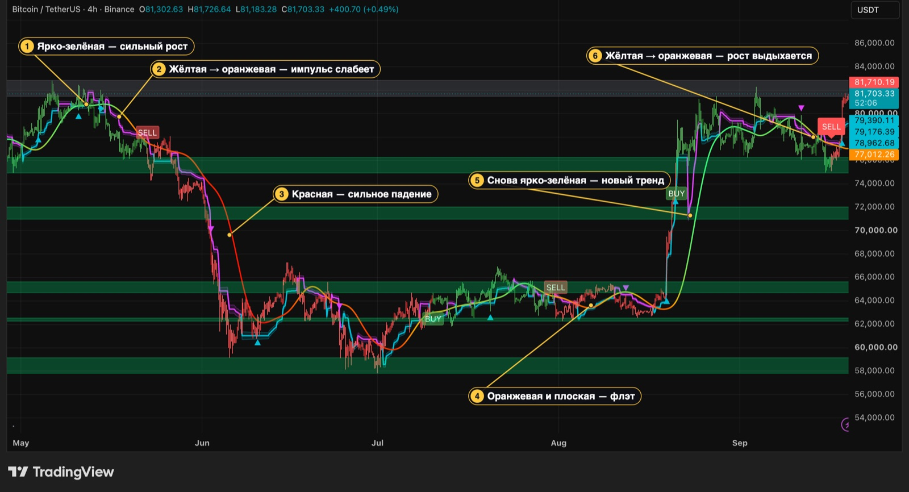
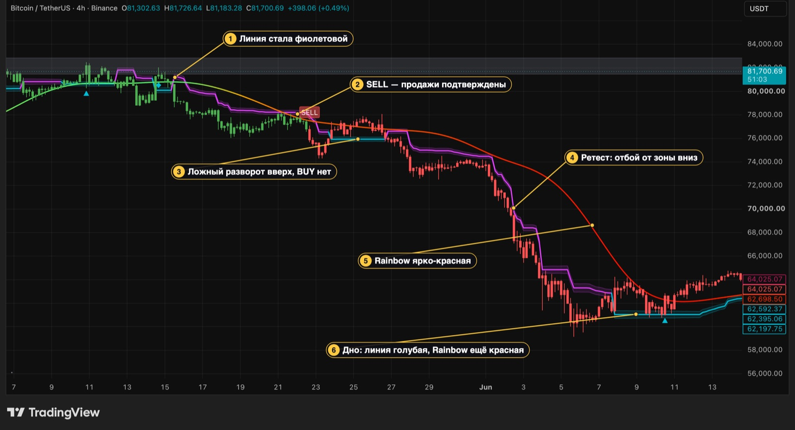
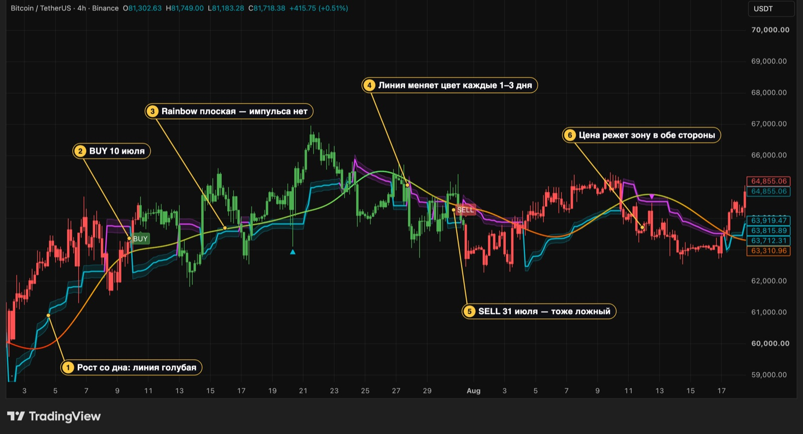
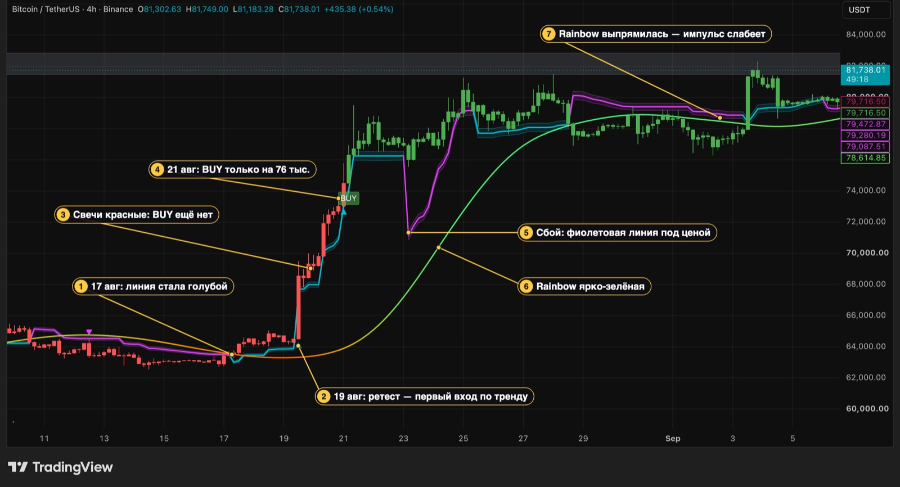
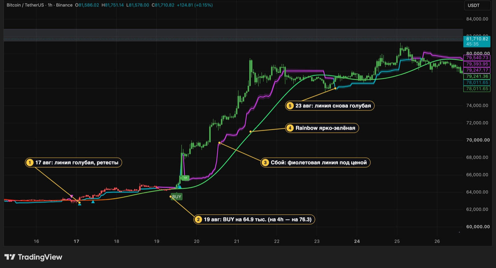
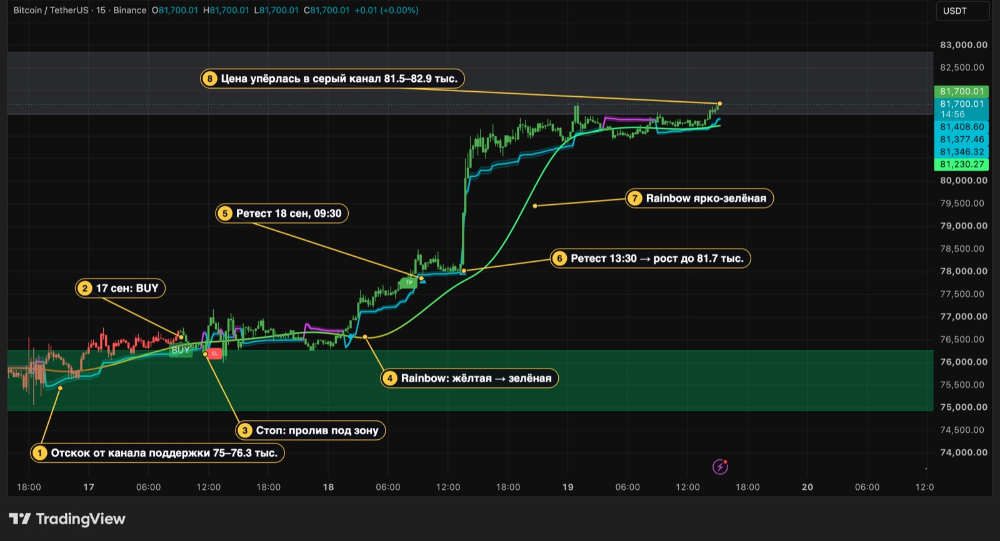
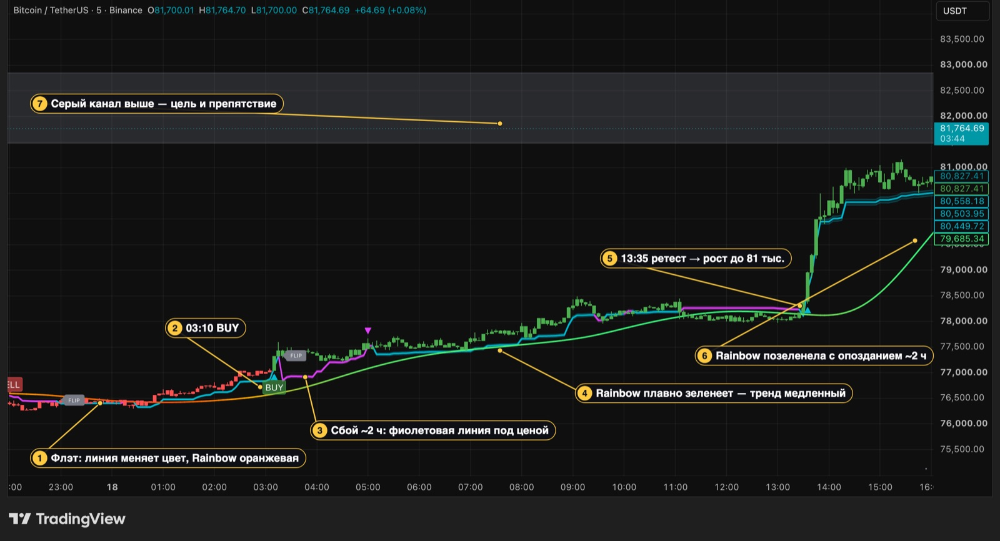
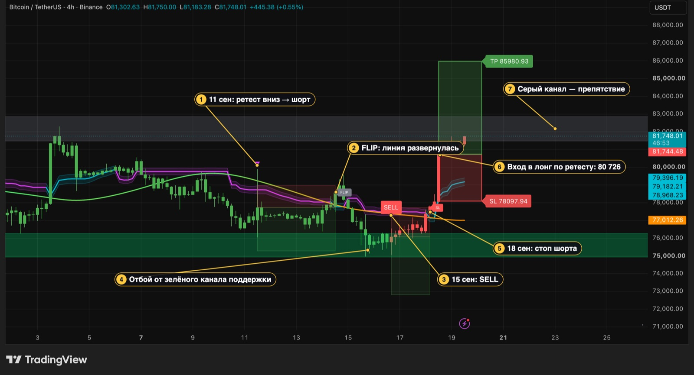
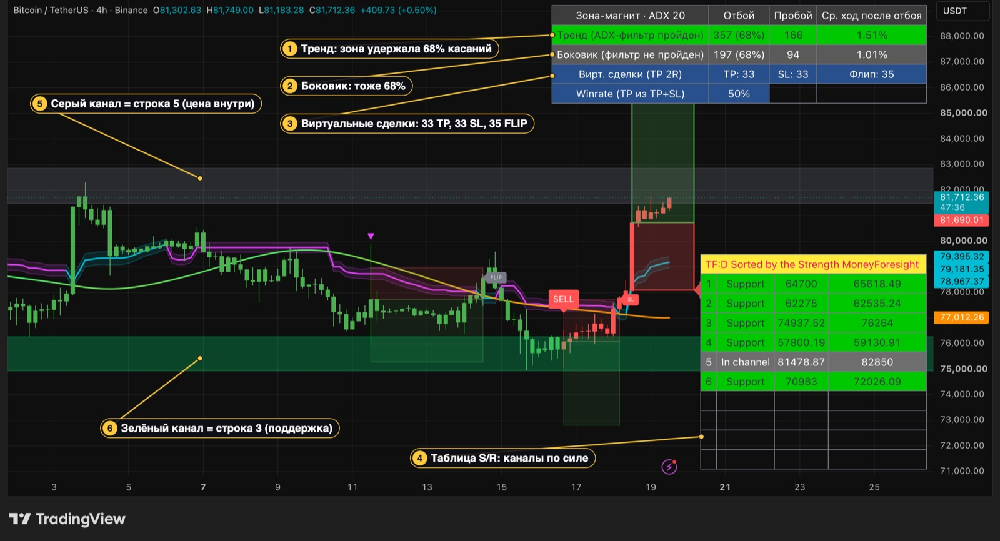

# Как работать с индикатором MoneyForesight

Руководство на реальных графиках: из чего состоит индикатор, как по нему читать тренд, куда
стремится цена, где покупать и где лучше не покупать. Стоп и тейк разобраны в конце, когда
сетап уже сложился.

Все примеры — **реальный BTCUSDT (Binance) в TradingView**, снимки от 19 сентября 2026,
индикатор [`MoneyForesight_v3.pine`](../MoneyForesight_v3.pine) v3.2 с настройками по умолчанию.
Жёлтые номера на картинках добавлены для пояснений. Установка и полный список настроек — в
[README](../README.md).

> **Это не финансовая рекомендация.** Здесь описано, как устроен индикатор и что показала история.
> Где правило не проверено на данных, это сказано прямо. Любую схему сначала проверьте в
> «Тестере стратегий» и на демо-счёте.

## Содержание

- [Из чего состоит индикатор](#из-чего-состоит-индикатор)
- [Полный цикл на одном графике](#полный-цикл-на-одном-графике)
- [1. Rainbow MA — термометр импульса](#1-rainbow-ma--термометр-импульса)
- [2. Линия Chandelier и зона-магнит — граница тренда](#2-линия-chandelier-и-зона-магнит--граница-тренда)
- [3. Три режима рынка на реальных примерах](#3-три-режима-рынка-на-реальных-примерах)
- [4. Куда стремится цена: зоны ликвидности и уровни](#4-куда-стремится-цена-зоны-ликвидности-и-уровни)
- [5. Где покупать, а где нет](#5-где-покупать-а-где-нет)
- [6. Младшие таймфреймы: 1h, 15m, 5m](#6-младшие-таймфреймы-1h-15m-5m)
- [7. Сетап: вход, стоп и тейк](#7-сетап-вход-стоп-и-тейк)
- [8. Таблицы: отбой, пробой, уровни](#8-таблицы-отбой-пробой-уровни)
- [9. Частые ошибки](#9-частые-ошибки)
- [Приложение: точные условия сигналов](#приложение-точные-условия-сигналов)

## Из чего состоит индикатор

На графике шесть слоёв. Каждый отвечает на свой вопрос.

| Слой | Как выглядит | Вопрос, на который отвечает |
|---|---|---|
| **Rainbow MA** | Толстая плавная линия, цвет от ярко-красного через оранжевый до ярко-зелёного | Насколько силён текущий ход и в какую сторону? |
| **Линия Chandelier** | Ступенчатая линия: **голубая** под ценой или **фиолетовая** над ценой | Кто контролирует рынок: покупатели или продавцы? |
| **Зона-магнит** | Полупрозрачная полоса вокруг линии Chandelier | Куда цена вернётся на откате и где у неё опора? |
| **Цвет свечей** | Зелёные или красные свечи | Какой сигнал сейчас действует: последний BUY или SELL? |
| **Метки** | BUY / SELL, треугольники, ромбы | Где был вход? |
| **Каналы S/R** | Горизонтальные полосы с дневного таймфрейма | Где цена затормозит или развернётся? |

Плюс две таблицы: статистика отбоев и пробоев (справа сверху) и список уровней S/R.

> **Если свечи не перекрашиваются в зелёный и красный**, свечи графика рисуются поверх индикатора.
> Наведите курсор на название индикатора на графике → «⋯» → **Visual order → Bring to front**.

## Полный цикл на одном графике

За пять месяцев BTC прошёл все фазы, и на этом графике видно, как индикатор их показывает:

1. **Начало мая — рост.** Rainbow ярко-зелёная, линия голубая под ценой, свечи зелёные.
2. **Середина мая — рост выдыхается.** 15 мая линия Chandelier стала фиолетовой. Через несколько
   дней Rainbow из зелёной стала жёлтой, потом оранжевой, а 22 мая пришёл SELL. Цена в это время
   ещё держалась у 76–78 тысяч.
3. **Июнь — обвал.** Rainbow ярко-красная, фиолетовая линия ступенями идёт вниз за ценой:
   с 76 до 58 тысяч.
4. **Июль — середина августа — флэт.** Rainbow оранжево-жёлтая и почти плоская, линия то и дело
   меняет цвет, BUY 10 июля и SELL 31 июля оба оказались ложными.
5. **17–25 августа — новый тренд.** Линия стала голубой на 63.6 тыс., Rainbow за несколько дней
   прошла путь от оранжевой до ярко-зелёной, цена ушла к 80 тысячам.
6. **Сентябрь — снова выдыхается.** Rainbow выпрямилась и пожелтела, 15 сентября — SELL.

Дальше каждый слой разобран отдельно.

## 1. Rainbow MA — термометр импульса

Rainbow — это сглаженная средняя цены за последние 50 свечей. Веса распределены «колоколом»,
поэтому линия очень плавная и **запаздывает примерно на 25 свечей**: на 4h это около 4 дней,
на 1h — сутки, на 15m — 6 часов, на 5m — 2 часа.

**Цвет Rainbow** — это RSI самой линии. Он показывает, насколько стабильно линия росла или падала
последние 50 свечей:

| Цвет | RSI линии | Что происходит | Что это значит для торговли |
|---|---|---|---|
| Ярко-зелёный | 80–100 | Линия растёт почти каждую свечу | Сильный устойчивый рост. Покупки по откатам, против тренда не шортить |
| Салатовый, жёлто-зелёный | 60–75 | Рост продолжается, но замедляется | Тренд ещё жив, новые покупки осторожнее |
| Жёлтый → оранжевый | 45–55 | Линия почти плоская | Импульса нет: флэт или смена тренда. Лучше подождать |
| Красно-оранжевый | 25–40 | Снижение набирает ход | Только продажи |
| Ярко-красный | 0–20 | Линия падает почти каждую свечу | Сильное падение. Продажи по откатам, дно не ловить |

Как этим пользоваться:

- **Rainbow — фильтр сигналов.** BUY возможен, только когда Rainbow в зелёной половине палитры
  (зеленее оранжевого). SELL — только в красной половине.
- **Пожелтение — признак, что рост закончился.** Rainbow запаздывает, поэтому желтеет уже после
  вершины, но часто раньше, чем начнётся сильное падение. В мае она пожелтела, пока цена ещё
  держалась у 76–78 тысяч, — за неделю до обвала.
- **Rainbow запаздывает на развороте.** В августе линия Chandelier развернулась вверх на
  63.6 тыс., а Rainbow дошла до зелёной половины только через 4 дня, поэтому BUY появился на
  76 тыс. (подробно — в [разделе 3](#восходящий-тренд-август)). Rainbow подтверждает тренд, но
  не ловит его начало.
- **Цена относительно Rainbow.** В сильном росте цена идёт над зелёной Rainbow, в сильном падении
  — под красной. Если цена «прилипла» к оранжевой Rainbow и ходит вокруг неё — это флэт.
  *Это визуальная подсказка, в правилах индикатора используется только цвет.*

## 2. Линия Chandelier и зона-магнит — граница тренда

Линия Chandelier — это **скользящий стоп по волатильности**. Она всегда стоит по одну сторону
от цены, и её цвет показывает, кто контролирует рынок.

- **Голубая, под ценой — восходящий тренд.** Линия равна максимуму последних 22 свечей минус
  3 ATR. Она тянется за ценой вверх и не опускается: на откате стоит на месте.
- **Фиолетовая, над ценой — нисходящий тренд.** Минимум 22 свечей плюс 3 ATR. Идёт за ценой вниз
  и не поднимается.

### Как образуется восходящий тренд

1. Идёт падение, фиолетовая линия висит над ценой и спускается ступенями.
2. Цена разворачивается и растёт. Фиолетовая линия стоит на месте — вверх она не ходит.
3. Свеча **закрывается выше фиолетовой линии**. Значит, цена ушла от недавнего минимума больше
   чем на 3 ATR — это уже не шум.
4. Линия «перепрыгивает» под цену и становится голубой.

**Нисходящий тренд** образуется зеркально: свеча закрывается ниже голубой линии, линия уходит
над ценой и становится фиолетовой.

Важно:

- **Считается только закрытие свечи.** Тень, проколовшая линию, тренд не меняет.
- **Смена цвета линии — ещё не сигнал.** Пересечение линии вверх действительно означает переход к
  покупкам, а вниз — к продажам. Но BUY или SELL появится, только если разворот подтвердят
  Rainbow, DMI, MACD, объём и ADX. Если линия развернулась, а метки нет — разворот ничем не
  подтверждён.

### Зона-магнит

Вокруг линии — полупрозрачная полоса шириной ± 0.25 ATR. Это **зона ликвидности**: в тренде цена
откатывает к ней и отбивается, как от магнита.

- В восходящем тренде зона — **поддержка**: на откате цена приходит в голубую зону и снова уходит
  вверх.
- В нисходящем — **сопротивление**: на отскоке цена упирается в фиолетовую зону и снова падает.
- Когда цена проходит зону насквозь и закрывается за линией — тренд сломан, линия меняет цвет.

Насколько хорошо магнит держит на вашем графике, показывает таблица статистики. На BTC 4h зона
удержала цену в 68% касаний (см. [раздел 8](#8-таблицы-отбой-пробой-уровни)).

### Сбой линии после резкого импульса

Иногда после вертикальной свечи линия ведёт себя странно: становится **фиолетовой, но оказывается
под ценой** (или голубой над ценой) и остаётся так несколько свечей. Это особенность формулы
разворота: он засчитывается только при *пересечении* линии, а после резкого хода линия может
«перескочить» цену без пересечения. На BTC так бывает на 5–11% свечей, обычно 3–6 свечей подряд.

Пример — 1h, 19–23 августа (картинка в [разделе 6](#1h)): весь рост с 68 до 77 тысяч линия была
фиолетовой, хотя стояла под ценой.

**Что делать:** пока линия стоит не на своей стороне, не открывайте сделки по ней. Ориентируйтесь на
Rainbow и ждите, когда линия вернётся на свою сторону.

## 3. Три режима рынка на реальных примерах

### Нисходящий тренд: май — июнь

1. **15 мая** свеча закрылась под голубой линией, и линия стала фиолетовой. Rainbow ещё зелёная:
   она запаздывает и пожелтеет только через несколько дней.
2. **22 мая — SELL** на 75.9 тыс.: Rainbow ушла в красную половину, все фильтры подтвердили.
   Свечи с этого момента красные.
3. **23–26 мая** линия на три дня стала голубой, но BUY не было: Rainbow оставалась красной.
   Классический ложный разворот внутри падения — по линии без подтверждения покупать нельзя.
4. **2 июня — ретест вниз** на 67.3 тыс.: отскок уткнулся в фиолетовую зону, свеча закрылась под
   ней. Продажа от зоны по тренду.
5. **Rainbow ярко-красная** весь обвал: пока она такая, покупать «на дне» рано.
6. **7–10 июня** линия развернулась вверх на 63.3 тыс., но Rainbow ещё ярко-красная, и BUY нет.
   Это не вход, а первый признак, что падение заканчивается.

### Флэт: июль — август

1. **Начало июля** — отскок со дна: линия голубая и идёт ступенями вверх.
2. **10 июля — BUY** на 64 тыс. Цена поднялась всего до 67 тыс. и вернулась.
3. **Rainbow плоская**, жёлто-зелёная, а потом оранжевая. Импульса нет.
4. **Линия меняет цвет каждые 1–3 дня**: за шесть недель около 18 разворотов.
5. **31 июля — SELL** на 62.7 тыс. Тоже ложный: цена так и осталась в диапазоне 62–65.5 тыс.
6. **Цена режет зону в обе стороны**: ни голубая, ни фиолетовая зона не держит.

Признаки флэта сразу видны на графике: плоская оранжево-жёлтая Rainbow, частая смена цвета линии,
цена ходит сквозь зону. **Во флэте индикатор выдаёт больше всего ложных сигналов — лучше не
торговать.**

### Восходящий тренд: август

1. **17 августа** свеча закрылась над фиолетовой линией на 63.6 тыс., линия стала голубой.
2. **19 августа — ретест**: цена вернулась к голубой зоне и закрылась над ней. Это **первый вход по
   тренду**, раньше любого BUY.
3. **Свечи красные**, хотя цена растёт: действует прошлый SELL от 31 июля. Rainbow ещё
   красно-оранжевая, и индикатор не может дать BUY.
4. **21 августа — BUY** только на 76.3 тыс., когда Rainbow дошла до зелёной половины. Вход по BUY
   оказался на 20% выше разворота линии. Поэтому в начале тренда ретесты дают более ранний вход.
5. **23–25 августа — сбой линии** после вертикального роста: фиолетовая линия под ценой
   (см. [выше](#сбой-линии-после-резкого-импульса)).
6. **Rainbow ярко-зелёная** — тренд в полной силе.
7. **Сентябрь** — Rainbow выпрямилась и начала желтеть: рост выдыхается.

## 4. Куда стремится цена: зоны ликвидности и уровни

У цены два типа «магнитов»:

- **Ближний — зона-магнит вокруг линии Chandelier.** В тренде цена откатывает к ней и оттуда
  продолжает движение. Это место для входа по тренду.
- **Дальние — каналы поддержки и сопротивления (S/R).** Построены по дневным свечам. Цена
  тормозит у них, разворачивается или пробивает их. Это цели и препятствия.

### Каналы S/R

| Цвет | Значение |
|---|---|
| Зелёный | **Поддержка**: канал целиком ниже цены |
| Красный | **Сопротивление**: канал целиком выше цены |
| Серый | Цена сейчас **внутри** канала |

Как строятся: на дневных свечах за последние 250 дней ищутся локальные максимумы и минимумы
(пивоты), близкие пивоты объединяются в канал. Сила канала: +20 за каждый пивот и +1 за каждую
свечу, которая его задела. Показываются 6 самых сильных. Уровни берутся только с **закрытых**
дневных свечей, поэтому внутри дня не перерисовываются.

Реальные примеры:

- **Отбой от поддержки.** 15–17 сентября BTC опустился в зелёный канал 74.9–76.3 тыс. и отскочил от
  него (картинка в [разделе 7](#7-сетап-вход-стоп-и-тейк)).
- **Упор в сопротивление.** 18–19 сентября рост на 15m остановился ровно у нижней границы серого
  канала 81.5–82.9 тыс. (картинка в [разделе 6](#15m)).

**Ограничение.** Уровни пересчитываются только на последней свече, на истории их нет. Поэтому
правила с уровнями нельзя проверить бэктестом — это здравый смысл, а не статистика.

## 5. Где покупать, а где нет

### Лучшее место для покупки

Покупка складывается из трёх слоёв. Чем больше совпало, тем лучше:

1. **Тренд:** линия голубая, цена над зоной.
2. **Импульс:** Rainbow в зелёной половине или разворачивается к ней из оранжевой.
3. **Место:** цена откатила в голубую зону и закрылась над ней — треугольник-ретест.

Дополнительно:

- рядом снизу зелёный канал поддержки — вторая опора;
- до цели нет красного или серого канала;
- после выбитого стопа, если тренд жив и цена обновила максимум 5 свечей — ромб (повторный вход).

**BUY — ранний, но самый шумный вход.** По статистике входы по ретестам и повторные входы
отрабатывают лучше, чем вход прямо на BUY (таблица ниже). Осторожный вариант — отметить BUY как
«тренд сменился» и дождаться первого ретеста.

### Где лучше не покупать

- **Линия фиолетовая** — тренд вниз, покупка против него. Пример: ложный разворот 23–26 мая.
- **Rainbow плоская, оранжево-жёлтая** — флэт, как в июле — августе.
- **Rainbow ярко-красная** — сильное падение, дно ещё не подтверждено (начало июня).
- **Прямо под красным или серым каналом** — тейк может упереться в уровень.
- **Цена убежала далеко от зоны** — вход поздний, стоп получится далёким (метка сорта B).
- **Сразу после вертикальной свечи, пока линия «сбоит»** — фиолетовая под ценой или голубая над ценой.
- **Внутри незакрытой свечи** — сигнал может исчезнуть. Держите включённым `Signals on Bar Close Only`.

### Продажи — зеркально

Продавать при **фиолетовой** линии над ценой и Rainbow в красной половине — на отскоке вверх в
фиолетовую зону с закрытием под ней (треугольник вниз). Не продавать во флэте, при зелёной Rainbow
и **прямо над зелёным каналом поддержки**: реальный пример такой ошибки разобран в
[разделе 7](#7-сетап-вход-стоп-и-тейк).

### Что говорит статистика

Бэктест BTCUSDT + ETHUSDT + SOLUSDT, февраль 2023 — сентябрь 2026, настройки по умолчанию, с
комиссией и проскальзыванием. PF (profit factor) — прибыль, делённая на убытки; больше 1 — в плюсе.

| Тип входа | 4h: сделок | 4h: PF | 1h: PF |
|---|---|---|---|
| BUY / SELL (смена тренда) | 110 | **0.91** | 0.77 |
| Ретест (треугольник) | 262 | **1.32** | 0.97 |
| Повторный вход (ромб) | 42 | **2.09** | 1.07 |

Смена тренда часто оказывается ложной — как BUY 10 июля и SELL 31 июля. Входы по уже
подтверждённому тренду (ретесты и повторные входы) дают основную прибыль.

## 6. Младшие таймфреймы: 1h, 15m, 5m

Логика та же, но всё происходит быстрее: сигналы раньше, отставание Rainbow меньше по времени,
шума больше.

### 1h

Тот же августовский рост, что на 4h:

1. 17 августа — линия голубая, ретесты у зоны.
2. **19 августа — BUY на 64.9 тыс.** На 4h BUY в этом движении пришёл только на 76.3 тыс.
   Младший таймфрейм поймал начало тренда на 11 тысяч раньше.
3. Сразу после вертикальной свечи — **сбой линии**: фиолетовая под ценой весь рост до 23 августа.
4. Rainbow ярко-зелёная — импульс сильный, ориентир в момент сбоя линии.
5. 23 августа линия вернулась на свою сторону.

### 15m

1. Цена отскочила от зелёного канала поддержки 75–76.3 тыс.
2. 17 сентября — BUY.
3. Стоп выбило проливом под зону — обычный шум младшего ТФ.
4. Rainbow из жёлтой становится зелёной — импульс набирает силу.
5. 18 сентября, 09:30 — ретест у голубой зоны.
6. 13:30 — второй ретест, после него рост до 81.7 тыс.
7. Rainbow ярко-зелёная.
8. Рост остановился у нижней границы серого канала 81.5–82.9 тыс. — дальнего «магнита».

### 5m

1. Флэт: линия меняет цвет, Rainbow оранжевая — не торговать.
2. 03:10 — BUY.
3. Сразу после — сбой линии примерно на 2 часа.
4. Rainbow плавно зеленеет — тренд есть, но медленный.
5. 13:35 — ретест, после него рост до 81 тыс.
6. Rainbow стала ярко-зелёной уже после рывка: на 5m её запаздывание — около 2 часов.
7. Серый канал выше — следующая цель и препятствие.

### Как работать на младших ТФ

- **Сверяйтесь со старшим таймфреймом.** Покупайте на 15m или 1h, когда на 4h линия голубая и
  Rainbow не красная. *Это распространённая практика; в бэктесте проекта она не проверялась.*
- **Смотрите таблицу статистики на своём таймфрейме.** Если отбоев в тренде мало, магнит здесь не
  работает.
- **Помните о комиссии.** На 5m–1h движения короче, а комиссия та же. Поэтому в бэктесте по сетке
  без отбора сделок итог на младших ТФ отрицательный. Чёткие тренды там бывают, как в примерах выше,
  но входить стоит только в них и пропускать флэт.

## 7. Сетап: вход, стоп и тейк

Когда тренд, импульс и место совпали, остаётся рассчитать сделку. Индикатор делает это сам и
рисует виртуальную сделку: красный бокс — риск, зелёный — прибыль.

**Правила расчёта:**

- **Вход** — по закрытию сигнальной свечи.
- **Стоп** — за внешним краем зоны (для лонга — под нижним краем). У повторного входа — под
  минимумом 5 свечей перед пробоем.
- **Тейк** — вход + 2 × риск, где риск = вход − стоп (настройка `Take Profit (R multiple)`).
- **Выход по FLIP** — если линия развернулась против сделки раньше тейка или стопа.
- Одновременно открыта только одна сделка.

**Что произошло на картинке:**

1. **11 сентября — ретест вниз**, шорт от фиолетовой зоны.
2. **14 сентября — FLIP**: линия стала голубой, сделка закрыта досрочно.
3. **15 сентября — SELL** на 76.5 тыс.
4. Но SELL пришёл **всего в ~250 долларах над зелёным каналом поддержки** 74.9–76.3 тыс. Цена
   отскочила от поддержки…
5. …и **18 сентября** шорт выбило по стопу. Это та самая ошибка «продавать прямо над поддержкой»
   из раздела 5: тейк был за уровнем, до которого цена не дошла.
6. **18 сентября — вход в лонг по ретесту** на 80 726. Свечи при этом красные: SELL ещё действует,
   но ретест не зависит от состояния сигнала — ему нужны голубая линия, MACD и разница DI.
   Стоп — 78 098 (под зоной), риск 2 628. Тейк — 80 726 + 2 × 2 628 = **85 981**.
7. **Серый канал 81.5–82.9 тыс.** лежит между входом и тейком. Цена уже дошла до него. Это первое
   препятствие: если канал не пробьётся, до тейка цена может не дойти.

**Размер позиции.** Считайте от риска, а не «на глаз»:

`объём = депозит × риск% / (вход − стоп)`

Пример для сделки выше: депозит 10 000 USDT, риск 1% → 100 / 2 628 = **0.038 BTC**. При стопе в
2 628 долларов этот объём рискует ровно 100 USDT.

## 8. Таблицы: отбой, пробой, уровни

### Таблица статистики (справа сверху)

Проверяет, работает ли зона-магнит на вашем графике. Считается по всей загруженной истории.

- **Отбой** — цена зашла в зону и закрылась обратно за её внешним краем по тренду (на той же свече
  или позже).
- **Пробой** — смена тренда: свеча закрылась за линией, линия сменила цвет.
- **Ср. ход после отбоя** — средний ход от закрытия свечи отбоя до лучшей цены, пока цена не
  вернулась в зону. Это *максимально возможный* ход, а не реальная прибыль.
- Строки **Тренд** и **Боковик** разделены по ADX в момент, когда цена вошла в зону.

**Как читать BTC 4h на картинке:**

1. **Тренд: 357 отбоев и 166 пробоев** — зона удержала цену в 68% касаний, средний ход после
   отбоя 1.51%.
2. **Боковик: тоже 68%**, но средний ход после отбоя меньше — 1.01%. Во флэте отбои случаются так
   же часто, но движение после них короче. Поэтому торговать отбои выгоднее в тренде.
3. **Виртуальные сделки: 33 тейка, 33 стопа, 35 выходов по FLIP.** Winrate 50% считается только из
   тейков и стопов. Безубыточный winrate для тейка 2R — 33% (формула: 1 / (1 + R)). Но выходы по
   FLIP в winrate не входят, а бывают и в плюс, и в минус, и комиссия не учтена. Настоящий результат
   смотрите в «Тестере стратегий» со стратегией
   [`MoneyForesight_strategy.pine`](../MoneyForesight_strategy.pine).

Ориентиры (не жёсткие пороги):

| Что видите | Вывод |
|---|---|
| Отбоев в тренде 60% и больше | Магнит работает, ретесты имеют смысл |
| Отбоев в тренде около 50% или меньше | Зона не держит — ретесты на этом графике не торговать |
| Средний ход в тренде заметно больше, чем в боковике | Торговать только в тренде |

### Таблица уровней S/R

4. **Таблица** отсортирована по силе, строка 1 — самый сильный канал. Столбцы: номер, тип, нижняя и
   верхняя граница.
5. **Серый канал на графике — строка 5** «In channel» 81 479–82 850: цена сейчас внутри него.
6. **Зелёный канал на графике — строка 3**, поддержка 74 938–76 264, от которой был отскок
   15–17 сентября.

Расположение таблицы меняется в настройках: группа «6 · Поддержка / сопротивление» → `Table Location`.

## 9. Частые ошибки

- **Входить на смене цвета линии без BUY или SELL.** 23–26 мая линия стала голубой, но это был
  ложный разворот.
- **Торговать во флэте.** Плоская оранжевая Rainbow и частые развороты линии — сигнал стоять в стороне.
- **Продавать прямо над поддержкой и покупать под сопротивлением.** Пример: SELL 15 сентября.
- **Ждать BUY в начале сильного тренда.** Rainbow запаздывает: в августе BUY пришёл на 20% выше
  разворота, а ретест дал вход раньше.
- **Доверять линии во время сбоя**, когда она стоит не на своей стороне цены.
- **Одинаковый объём при любом стопе.** При далёком стопе риск в деньгах вырастает в разы.
- **Верить winrate из таблицы** без учёта FLIP и комиссии.
- **Подкручивать ядро индикатора** (периоды Chandelier, DMI, MACD, Rainbow) под историю.

## Приложение: точные условия сигналов

Все условия проверяются по закрытию свечи.

**BUY** — все условия на одной свече:

| Условие | Что проверяет |
|---|---|
| Линия Chandelier голубая | Тренд по волатильности вверх |
| DI+ выше DI− | Покупатели сильнее продавцов |
| MACD выше сигнальной линии | Импульс вверх |
| Rainbow в зелёной половине (RSI линии > 50) | Сила на стороне покупателей |
| Объём выше средней за 20 свечей × 1.2 | Движение поддержано деньгами |
| ADX ≥ 20, или ADX ≥ 10 и растёт 3 свечи | Есть тренд |

SELL — зеркально. Метка ставится один раз, в момент смены состояния.

**Сорт A и B.** Яркая метка — стоп не дальше 2 ATR, бледная — дальше. Это не оценка качества: в
бэктесте сорт B отработал не хуже A. Сорт говорит о размере риска, при сорте B позицию берите меньше.

**Ретест (треугольник)**: линия одного цвета минимум 2 свечи; цена зашла в зону (тенью или
закрытием прошлой свечи) и закрылась за её внешним краем; MACD по направлению сделки; разница
DI+ и DI− не меньше 5; объём и ADX в порядке; с прошлого ретеста в ту же сторону прошло больше
5 свечей.

**Повторный вход (ромб)**: только после сделки, закрытой по стопу, и только в ту же сторону; все
условия BUY выполняются сейчас; свеча закрылась выше максимума 5 предыдущих свечей (для шорта —
ниже минимума); разница DI не меньше 5.
